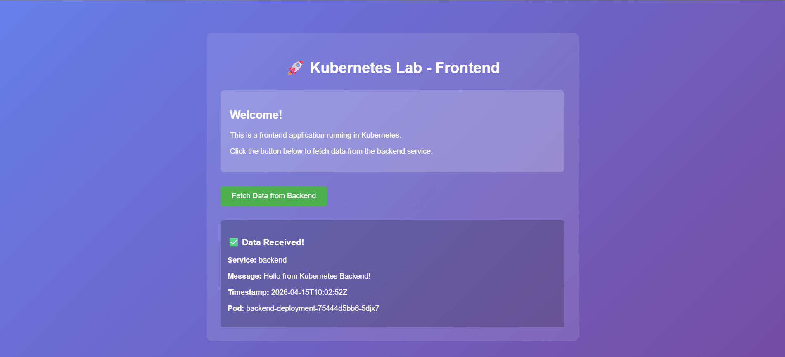

# Лабораторная работа №5: Основы Kubernetes (k8s)

## Структура проекта

```
k8s-lab/
├── examples/
│   ├── frontend/           # Frontend приложение (Node.js)
│   │   ├── app.js
│   │   ├── package.json
│   │   ├── Dockerfile
│   │   └── public/
│   │       └── index.html
│   └── backend/            # Backend приложение (Go)
│       ├── main.go
│       ├── go.mod
│       └── Dockerfile
├── k8s-manifests/          # Kubernetes манифесты
│   ├── namespace.yaml
│   ├── frontend-deployment.yaml
│   ├── backend-deployment.yaml
│   ├── frontend-service.yaml
│   ├── backend-service.yaml
│   ├── configmap.yaml          # Задание 1: ConfigMap
│   ├── secret.yaml             # Задание 1: Secret
│   ├── ingress.yaml            # Задание 2: Ingress
│   └── hpa.yaml                # Задание 4: Horizontal Pod Autoscaler
└── README.md               # Этот файл
```

## Инструкция по выполнению

### Шаг 1: Подготовка Docker-образов

# Сборка образа frontend
*cd examples/frontend*
*docker build -t k8s-frontend:1.0 .*
```bash
[+] Building 1.4s (10/10) FINISHED                                                                                            docker:desktop-linux
 => [internal] load build definition from Dockerfile                                                                                          0.0s
 => => transferring dockerfile: 321B                                                                                                          0.0s
 => [internal] load metadata for docker.io/library/node:18-alpine                                                                             1.0s
 => [internal] load .dockerignore                                                                                                             0.0s
 => => transferring context: 2B                                                                                                               0.0s
 => [1/5] FROM docker.io/library/node:18-alpine@sha256:8d6421d663b4c28fd3ebc498332f249011d118945588d0a35cb9bc4b8ca09d9e                       0.1s
 => => resolve docker.io/library/node:18-alpine@sha256:8d6421d663b4c28fd3ebc498332f249011d118945588d0a35cb9bc4b8ca09d9e                       0.1s
 => [internal] load build context                                                                                                             0.0s
 => => transferring context: 153B                                                                                                             0.0s
 => CACHED [2/5] WORKDIR /app                                                                                                                 0.0s
 => CACHED [3/5] COPY package*.json ./                                                                                                        0.0s
 => CACHED [4/5] RUN npm install --production                                                                                                 0.0s 
 => CACHED [5/5] COPY . .                                                                                                                     0.0s 
 => exporting to image                                                                                                                        0.1s
 => => exporting layers                                                                                                                       0.0s 
 => => exporting manifest sha256:8bcddd50ea35a4ebee5f7310cbc0b2d1449901833101b32d0556f5c7948a08b8                                             0.0s 
 => => exporting config sha256:5ce580039ea54bdbf2cc96769f41cc32e9cb509572ffdcc8914288d27c1ea73f                                               0.0s 
 => => exporting attestation manifest sha256:b22945f70f7d95afb6cefd34ac6925e3d527a262569bffd8f6180b0a66607e01                                 0.0s 
 => => exporting manifest list sha256:2a54f6185b168566430c3e976dea6234fec65f51604a46687e6cd3cd994bb07e                                        0.0s 
 => => naming to docker.io/library/k8s-frontend:1.0                                                                                           0.0s 
 => => unpacking to docker.io/library/k8s-frontend:1.0  
 ```


# Сборка образа backend
*cd ../backend*
*docker build -t k8s-backend:1.0 .*
```bash
[+] Building 1.3s (15/15) FINISHED                                                                                            docker:desktop-linux
 => [internal] load build definition from Dockerfile                                                                                          0.0s
 => => transferring dockerfile: 586B                                                                                                          0.0s 
 => [internal] load metadata for docker.io/library/alpine:latest                                                                              0.9s 
 => [internal] load metadata for docker.io/library/golang:1.21-alpine                                                                         0.9s 
 => [internal] load .dockerignore                                                                                                             0.0s
 => => transferring context: 2B                                                                                                               0.0s 
 => [builder 1/5] FROM docker.io/library/golang:1.21-alpine@sha256:2414035b086e3c42b99654c8b26e6f5b1b1598080d65fd03c7f499552ff4dc94           0.0s 
 => => resolve docker.io/library/golang:1.21-alpine@sha256:2414035b086e3c42b99654c8b26e6f5b1b1598080d65fd03c7f499552ff4dc94                   0.0s 
 => [stage-1 1/4] FROM docker.io/library/alpine:latest@sha256:25109184c71bdad752c8312a8623239686a9a2071e8825f20acb8f2198c3f659                0.0s 
 => => resolve docker.io/library/alpine:latest@sha256:25109184c71bdad752c8312a8623239686a9a2071e8825f20acb8f2198c3f659                        0.0s 
 => [internal] load build context                                                                                                             0.0s 
 => => transferring context: 54B                                                                                                              0.0s 
 => CACHED [stage-1 2/4] RUN apk --no-cache add ca-certificates                                                                               0.0s 
 => CACHED [stage-1 3/4] WORKDIR /root/                                                                                                       0.0s
 => CACHED [builder 2/5] WORKDIR /app                                                                                                         0.0s 
 => CACHED [builder 3/5] COPY go.mod .                                                                                                        0.0s 
 => CACHED [builder 4/5] COPY main.go .                                                                                                       0.0s 
 => CACHED [builder 5/5] RUN CGO_ENABLED=0 GOOS=linux go build -a -installsuffix cgo -o backend .                                             0.0s 
 => CACHED [stage-1 4/4] COPY --from=builder /app/backend .                                                                                   0.0s 
 => exporting to image                                                                                                                        0.1s 
 => => exporting layers                                                                                                                       0.0s 
 => => exporting manifest sha256:5e8e9e723b27d8c07d3fd8476c0db99ce80fe4b5d8c2d133b61c4d8dc0faeeaf                                             0.0s 
 => => exporting config sha256:00db35651c91c35f1c76e52f4b418b0ad53d96b63a1c781079c4cb0bc35e31b9                                               0.0s 
 => => exporting attestation manifest sha256:1de4778951e3455af4b9a54b5afe00a56a1ab889c43efe85cbe5a2be6d7be432                                 0.0s 
 => => exporting manifest list sha256:a443758d6b164a8b2571a21a764ca41a750978d17e8861d41b97b99d377de7da                                        0.0s 
 => => naming to docker.io/library/k8s-backend:1.0                                                                                            0.0s 
 => => unpacking to docker.io/library/k8s-backend:1.0 
```

### Шаг 2: Проверка образов

*docker images | findstr k8s*

```bash
k8s-backend                               1.0                                                                           a443758d6b16   14 minutes ago   25.8MB
k8s-frontend                              1.0                                                                           2a54f6185b16   15 minutes ago   203MB
registry.k8s.io/kube-scheduler            v1.34.1                                                                       6e9fbc4e25a5   7 months ago     73.5MB
registry.k8s.io/kube-controller-manager   v1.34.1                                                                       2bf47c1b01f5   7 months ago     101MB
registry.k8s.io/kube-apiserver            v1.34.1                                                                       b9d7c117f8ac   7 months ago     118MB
registry.k8s.io/kube-proxy                v1.34.1                                                                       913cc83ca0b5   7 months ago     102MB
registry.k8s.io/etcd                      3.6.4-0                                                                       e36c08168342   8 months ago     273MB
registry.k8s.io/pause                     3.10.1                                                                        278fb9dbcca9   10 months ago    1.06MB
registry.k8s.io/coredns/coredns           v1.12.1                                                                       e8c262566636   12 months ago    101MB
registry.k8s.io/pause                     3.10                                                                          ee6521f290b2   23 months ago    1.06MB
```


### Шаг 3: Применение Kubernetes манифестов

#### Создание namespace и всех ресурсов

*kubectl apply -f k8s-manifests/namespace.yaml*

```bash
secret/app-secret created
```
*kubectl apply -f k8s-manifests/*

```bash
deployment.apps/backend-deployment created
service/backend-service created
configmap/app-config created
deployment.apps/frontend-deployment created
service/frontend-service created
horizontalpodautoscaler.autoscaling/backend-hpa created
ingress.networking.k8s.io/app-ingress created
namespace/lab5 unchanged
secret/app-secret unchanged
```

### Шаг 4: Проверка развертывания

#### Проверка namespace

*kubectl get namespace lab5*

```bash
NAME   STATUS   AGE
lab5   Active   6m21s
```

#### Проверка deployments

*kubectl get deployments -n lab5*

```bash
NAME                  READY   UP-TO-DATE   AVAILABLE   AGE
backend-deployment    3/3     3            3           49s
frontend-deployment   2/2     2            2           49s
```

#### Проверка pods

*kubectl get pods -n lab5*

```bash
NAME                                  READY   STATUS    RESTARTS   AGE
backend-deployment-75444d5bb6-5djx7   1/1     Running   0          58s
backend-deployment-75444d5bb6-lvltq   1/1     Running   0          58s
backend-deployment-75444d5bb6-ztcrk   1/1     Running   0          58s
frontend-deployment-77bb9674b-5x9cj   1/1     Running   0          58s
frontend-deployment-77bb9674b-8m2d5   1/1     Running   0          58s
```

#### Проверка services

*kubectl get services -n lab5*

```bash
NAME               TYPE        CLUSTER-IP       EXTERNAL-IP   PORT(S)        AGE
backend-service    ClusterIP   10.106.102.168   <none>        5000/TCP       80s
frontend-service   NodePort    10.97.124.50     <none>        80:30080/TCP   80s
```

#### Подробная информация о pod

*kubectl describe pod kubectl describe pod backend-deployment-75444d5bb6-5djx7 -n lab5*

```bash
Name:             backend-deployment-75444d5bb6-5djx7
Namespace:        lab5
Priority:         0
Service Account:  default
Node:             docker-desktop/192.168.65.3
Start Time:       Wed, 15 Apr 2026 12:24:10 +0300
Labels:           app=backend
                  pod-template-hash=75444d5bb6
                  version=v1
Annotations:      <none>
Status:           Running
IP:               10.1.0.10
IPs:
  IP:           10.1.0.10
Controlled By:  ReplicaSet/backend-deployment-75444d5bb6
Containers:
  backend:
    Container ID:   docker://5e7736c04548b09ceab0aaa1e160920b5f41cf8b9665e21a836219b210987e8e
    Image:          k8s-backend:1.0
    Image ID:       docker-pullable://k8s-backend@sha256:a443758d6b164a8b2571a21a764ca41a750978d17e8861d41b97b99d377de7da
    Port:           5000/TCP (http)
    Host Port:      0/TCP (http)
    State:          Running
      Started:      Wed, 15 Apr 2026 12:24:12 +0300
    Ready:          True
    Restart Count:  0
    Limits:
      cpu:     100m
      memory:  128Mi
    Requests:
      cpu:      50m
      memory:   64Mi
    Liveness:   http-get http://:5000/health delay=30s timeout=1s period=10s #success=1 #failure=3
    Readiness:  http-get http://:5000/health delay=5s timeout=1s period=5s #success=1 #failure=3
    Environment:
      PORT:  5000
    Mounts:
      /var/run/secrets/kubernetes.io/serviceaccount from kube-api-access-b97cs (ro)
Conditions:
  Type                        Status
  PodReadyToStartContainers   True
  Initialized                 True
  Ready                       True
  ContainersReady             True
  PodScheduled                True
Volumes:
  kube-api-access-b97cs:
    Type:                    Projected (a volume that contains injected data from multiple sources)
    TokenExpirationSeconds:  3607
    ConfigMapName:           kube-root-ca.crt
    ConfigMapName:           kube-root-ca.crt
    ConfigMapName:           kube-root-ca.crt
    ConfigMapName:           kube-root-ca.crt
    ConfigMapName:           kube-root-ca.crt
    ConfigMapName:           kube-root-ca.crt
    Optional:                false
    DownwardAPI:             true
QoS Class:                   Burstable
Node-Selectors:              <none>
Tolerations:                 node.kubernetes.io/not-ready:NoExecute op=Exists for 300s
                             node.kubernetes.io/unreachable:NoExecute op=Exists for 300s
Events:
  Type    Reason     Age    From               Message
  ----    ------     ----   ----               -------
  Normal  Scheduled  3m49s  default-scheduler  Successfully assigned lab5/backend-deployment-75444d5bb6-5djx7 to docker-desktop
  Normal  Pulled     3m49s  kubelet            Container image "k8s-backend:1.0" already present on machine
  Normal  Created    3m48s  kubelet            Created container: backend
  Normal  Started    3m48s  kubelet            Started container backend
```

#### Просмотр логов

*kubectl logs backend-deployment-75444d5bb6-5djx7 -n lab5*

```bash
{"time":"2026-04-15T09:24:12.504251821Z","level":"INFO","msg":"Starting backend server","port":"5000","pod_name":"backend-deployment-75444d5bb6-5djx7"}
{"time":"2026-04-15T09:24:12.506341099Z","level":"INFO","msg":"Server started successfully","address":":5000"}
```

### Шаг 5: Доступ к приложению

#### Через NodePort:

Открыть браузер и перейти по адресу: **http://localhost:30080**

#### Через port-forwarding:

*kubectl port-forward service/frontend-service 8080:80 -n lab5*

```bash
Forwarding from 127.0.0.1:8080 -> 3000
Forwarding from [::1]:8080 -> 3000
Handling connection for 8080
Handling connection for 8080
Handling connection for 8080       
```

Затем открыть: **http://localhost:8080**

### Шаг 6: Тестирование

1. Открыть приложение в браузере
2. Нажать кнопку "Fetch Data from Backend"
3. Убедиться, что данные успешно получены
4. Проверить, что имя Pod отображается в ответе



### Шаг 7: Масштабирование

# Масштабирование frontend до 3 реплик

*kubectl scale deployment frontend-deployment --replicas=3 -n lab5*
*kubectl get pods -n lab5*

```bash
deployment.apps/frontend-deployment scaled

NAME                                  READY   STATUS    RESTARTS   AGE
backend-deployment-75444d5bb6-5djx7   1/1     Running   0          39m
backend-deployment-75444d5bb6-lvltq   1/1     Running   0          39m
backend-deployment-75444d5bb6-ztcrk   1/1     Running   0          39m
frontend-deployment-77bb9674b-5x9cj   1/1     Running   0          39m
frontend-deployment-77bb9674b-8m2d5   1/1     Running   0          39m
frontend-deployment-77bb9674b-tkcpx   1/1     Running   0          19s
```
# Масштабирование backend до 5 реплик

*kubectl scale deployment backend-deployment --replicas=5 -n lab5*
*kubectl get pods -n lab5*

```bash
deployment.apps/backend-deployment scaled

NAME                                  READY   STATUS              RESTARTS   AGE
backend-deployment-75444d5bb6-5djx7   1/1     Running             0          39m
backend-deployment-75444d5bb6-95wdr   0/1     ContainerCreating   0          1s
backend-deployment-75444d5bb6-bdm89   0/1     ContainerCreating   0          1s
backend-deployment-75444d5bb6-lvltq   1/1     Running             0          39m
backend-deployment-75444d5bb6-ztcrk   1/1     Running             0          39m
frontend-deployment-77bb9674b-5x9cj   1/1     Running             0          39m
frontend-deployment-77bb9674b-8m2d5   1/1     Running             0          39m
frontend-deployment-77bb9674b-tkcpx   1/1     Running             0          33s
```

### Шаг 8: Обновление приложения


# Сборка новой версии backend

*cd examples/backend*
*docker build -t k8s-backend:2.0 .*

```bash
[+] Building 1.5s (15/15) FINISHED                                                                                            docker:desktop-linux
 => [internal] load build definition from Dockerfile                                                                                          0.0s
 => => transferring dockerfile: 586B                                                                                                          0.0s 
 => [internal] load metadata for docker.io/library/alpine:latest                                                                              1.1s 
 => [internal] load metadata for docker.io/library/golang:1.21-alpine                                                                         1.1s 
 => [internal] load .dockerignore                                                                                                             0.0s
 => => transferring context: 2B                                                                                                               0.0s 
 => [builder 1/5] FROM docker.io/library/golang:1.21-alpine@sha256:2414035b086e3c42b99654c8b26e6f5b1b1598080d65fd03c7f499552ff4dc94           0.0s 
 => => resolve docker.io/library/golang:1.21-alpine@sha256:2414035b086e3c42b99654c8b26e6f5b1b1598080d65fd03c7f499552ff4dc94                   0.0s 
 => [internal] load build context                                                                                                             0.0s 
 => => transferring context: 54B                                                                                                              0.0s 
 => [stage-1 1/4] FROM docker.io/library/alpine:latest@sha256:25109184c71bdad752c8312a8623239686a9a2071e8825f20acb8f2198c3f659                0.0s 
 => => resolve docker.io/library/alpine:latest@sha256:25109184c71bdad752c8312a8623239686a9a2071e8825f20acb8f2198c3f659                        0.0s 
 => CACHED [stage-1 2/4] RUN apk --no-cache add ca-certificates                                                                               0.0s
 => CACHED [stage-1 3/4] WORKDIR /root/                                                                                                       0.0s 
 => CACHED [builder 2/5] WORKDIR /app                                                                                                         0.0s 
 => CACHED [builder 3/5] COPY go.mod .                                                                                                        0.0s 
 => CACHED [builder 4/5] COPY main.go .                                                                                                       0.0s 
 => CACHED [builder 5/5] RUN CGO_ENABLED=0 GOOS=linux go build -a -installsuffix cgo -o backend .                                             0.0s 
 => CACHED [stage-1 4/4] COPY --from=builder /app/backend .                                                                                   0.0s 
 => exporting to image                                                                                                                        0.1s 
 => => exporting layers                                                                                                                       0.0s 
 => => exporting manifest sha256:2fe9730303b034980a4d1566ef4a9c2c307529cb3909b8ae8e9a2545852e715d                                             0.0s 
 => => exporting config sha256:296faa59399530449c2a6591a534c54171a1577089c69d7b6822629babfc9c6b                                               0.0s 
 => => exporting attestation manifest sha256:974ed8ed8ec0c3f5f7903708c40678cb6a28b1f34bab19569befa2bbc1aa8fd6                                 0.0s 
 => => exporting manifest list sha256:58bf3abca37856a4d224343720f4674cb54e3c77384c727a61ce729e8d5eb986                                        0.0s 
 => => naming to docker.io/library/k8s-backend:2.0                                                                                            0.0s 
 => => unpacking to docker.io/library/k8s-backend:2.0                                                                                         0.0s
```

# Обновление deployment

*kubectl set image deployment/backend-deployment backend=k8s-backend:2.0 -n lab5*

```bash
deployment.apps/backend-deployment image updated
```

# Проверка статуса обновления

*kubectl rollout status deployment/backend-deployment -n lab5*

```bash
Waiting for deployment "backend-deployment" rollout to finish: 2 old replicas are pending termination...
Waiting for deployment "backend-deployment" rollout to finish: 2 old replicas are pending termination...
Waiting for deployment "backend-deployment" rollout to finish: 2 old replicas are pending termination...
Waiting for deployment "backend-deployment" rollout to finish: 1 old replicas are pending termination...
Waiting for deployment "backend-deployment" rollout to finish: 1 old replicas are pending termination...
Waiting for deployment "backend-deployment" rollout to finish: 1 old replicas are pending termination...
deployment "backend-deployment" successfully rolled out
```

# Просмотр истории обновлений

*kubectl rollout history deployment/backend-deployment -n lab5*

```bash
REVISION  CHANGE-CAUSE
1         <none>
2         <none>
```

# Откат к предыдущей версии

*kubectl rollout undo deployment/backend-deployment -n lab5*

```bash
deployment.apps/backend-deployment rolled back
```

### Шаг 9: Применение дополнительных манифестов (самостоятельная работа)

```bash
# Применение ConfigMap и Secret
kubectl apply -f k8s-manifests/configmap.yaml
kubectl apply -f k8s-manifests/secret.yaml

# Применение HPA
kubectl apply -f k8s-manifests/hpa.yaml
```

### Шаг 10: Очистка ресурсов

```bash
# Удаление всех ресурсов в namespace
kubectl delete namespace lab5

# Или удаление по манифестам
kubectl delete -f k8s-manifests/
```

