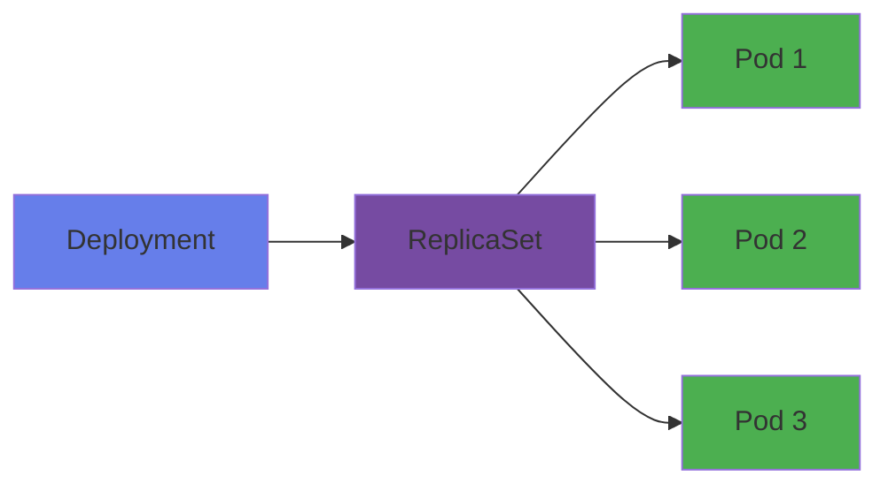
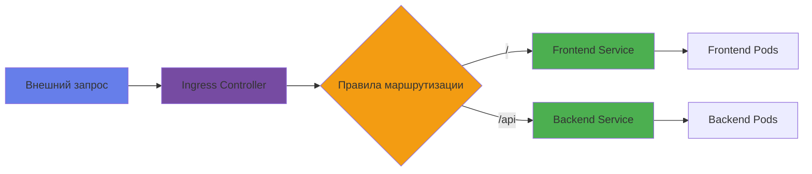

# Лабораторная работа №5: Основы Kubernetes (k8s)

## Цель работы

Освоить основы работы с Kubernetes — системой оркестрации контейнеризированных приложений. Научиться создавать Docker-образы для приложений, описывать их развертывание в Kubernetes с помощью YAML-манифестов и понимать ключевые концепции платформы.

## Требования

- Docker Desktop установлен и работает (версия 4.15+ с поддержкой Kubernetes)
- Kubernetes включён в Docker Desktop
- kubectl — инструмент командной строки для управления Kubernetes (входит в состав Docker Desktop)
- Базовые знания Docker (из лабораторных работ №2-3)
- Успешно выполненные лабораторные работы №1-4

---

## Настройка Docker Desktop с Kubernetes

Перед началом работы необходимо настроить Docker Desktop для работы с Kubernetes.

### Включение Kubernetes в Docker Desktop

1. **Откройте Docker Desktop**
   - Запустите Docker Desktop на вашем компьютере
   - Убедитесь, что Docker работает (иконка в системном трее активна)

2. **Перейдите в настройки**
   - Нажмите на иконку Docker Desktop в системном трее
   - Выберите **Settings** (Настройки)

3. **Включите Kubernetes**
   - В меню слева выберите **Kubernetes**
   - Поставьте галочку **Enable Kubernetes**
   - Нажмите **Apply & Restart**
   - Дождитесь завершения установки (это может занять несколько минут)

4. **Проверьте установку**
   ```bash
   # Проверьте статус кластера
   kubectl cluster-info
   
   # Проверьте узлы
   kubectl get nodes
   
   # Проверьте все pods в системном namespace
   kubectl get pods -n kube-system
   ```

   Вы должны увидеть один узел с именем `docker-desktop` и статусом `Ready`.

### Настройка контекста kubectl

Docker Desktop автоматически настраивает контекст `docker-desktop`. Проверьте текущий контекст:

```bash
# Показать текущий контекст
kubectl config current-context

# Показать все доступные контексты
kubectl config get-contexts

# Установить контекст docker-desktop (если нужно)
kubectl config use-context docker-desktop
```

### Особенности Docker Desktop Kubernetes

| Характеристика | Описание |
|---------------|----------|
| **Один узел** | Кластер состоит из одного узла `docker-desktop` |
| **Ресурсы** | Ограничены ресурсами вашего компьютера |
| **Перезагрузка** | При перезагрузке Docker Desktop кластер пересоздаётся |
| **Хранилище** | Использует хранилище Docker Desktop |
| **Сеть** | Сеть интегрирована с Docker |

### Устранение неполадок

**Проблема: Kubernetes не запускается**

```bash
# Проверьте логи Docker Desktop
# В Docker Desktop: Troubleshoot -> Diagnose & Feedback -> Diagnostic logs

# Перезапустите Docker Desktop
# Через системный трей: Quit Docker Desktop, затем запустите снова
```

**Проблема: kubectl не найден**

```bash
# Убедитесь, что kubectl установлен
kubectl version --client

# Если не установлен, скачайте с:
# https://kubernetes.io/ru/docs/tasks/tools/
```

**Проблема: Недостаточно ресурсов**

```bash
# В Docker Desktop: Settings -> Resources
# Увеличьте память и CPU для Docker
```

---

## Содержание

- [Часть 1: Подготовка примеров приложений](#часть-1-подготовка-примеров-приложений)
  - [1.1 Приложение Frontend](#11-приложение-frontend)
  - [1.2 Приложение Backend](#12-приложение-backend)
- [Часть 2: Основные концепции Kubernetes](#часть-2-основные-концепции-kubernetes)
  - [2.1 Pods](#21-pods)
  - [2.2 Deployments](#22-deployments)
  - [2.3 Services](#23-services)
  - [2.4 Namespaces](#24-namespaces)
  - [2.5 StatefulSets](#25-statefulsets)
  - [2.6 Ingress](#26-ingress)
- [Часть 3: Манифесты для развертывания в Kubernetes](#часть-3-манифесты-для-развертывания-в-kubernetes)
  - [3.1 Создание Namespace](#31-создание-namespace)
  - [3.2 Deployment для Frontend](#32-deployment-для-frontend)
  - [3.3 Deployment для Backend](#33-deployment-для-backend)
  - [3.4 Service для Frontend](#34-service-для-frontend)
  - [3.5 Service для Backend](#35-service-для-backend)
- [Часть 4: Практическое развертывание](#часть-4-практическое-развертывание)
- [Задание для самостоятельной работы](#задание-для-самостоятельной-работы)
- [Контрольные вопросы](#контрольные-вопросы)
- [Дополнительная документация](#дополнительная-документация)

---

## Часть 1: Подготовка примеров приложений

В этой части мы создадим два простых приложения: **frontend** и **backend**, которые будут контейнеризированы и развернуты в Kubernetes.

### 1.1 Приложение Frontend

Frontend — это простое веб-приложение на Node.js, которое отображает приветственную страницу и делает запросы к backend.

#### Структура проекта

```
examples/frontend/
├── app.js
├── package.json
├── Dockerfile
└── public/
    └── index.html
```

#### package.json

```json
{
  "name": "k8s-frontend",
  "version": "1.0.0",
  "description": "Frontend application for Kubernetes lab",
  "main": "app.js",
  "scripts": {
    "start": "node app.js"
  },
  "dependencies": {
    "express": "^4.18.2",
    "axios": "^1.6.0"
  }
}
```

#### app.js

```javascript
const express = require('express');
const axios = require('axios');
const path = require('path');

const app = express();
const PORT = process.env.PORT || 3000;
const BACKEND_URL = process.env.BACKEND_URL || 'http://backend:5000';

// Serve static files
app.use(express.static(path.join(__dirname, 'public')));

// API endpoint to fetch data from backend
app.get('/api/data', async (req, res) => {
  try {
    const response = await axios.get(`${BACKEND_URL}/api/info`);
    res.json(response.data);
  } catch (error) {
    console.error('Error fetching data from backend:', error.message);
    res.status(500).json({ error: 'Failed to fetch data from backend' });
  }
});

// Health check endpoint
app.get('/health', (req, res) => {
  res.json({ status: 'healthy', service: 'frontend' });
});

app.listen(PORT, () => {
  console.log(`Frontend server started on port ${PORT}`);
  console.log(`Backend URL: ${BACKEND_URL}`);
});
```

#### public/index.html

```html
<!DOCTYPE html>
<html lang="en">
<head>
    <meta charset="UTF-8">
    <meta name="viewport" content="width=device-width, initial-scale=1.0">
    <title>Kubernetes Lab - Frontend</title>
    <style>
        body {
            font-family: Arial, sans-serif;
            max-width: 800px;
            margin: 50px auto;
            padding: 20px;
            background: linear-gradient(135deg, #667eea 0%, #764ba2 100%);
            color: white;
        }
        .container {
            background: rgba(255, 255, 255, 0.1);
            border-radius: 10px;
            padding: 30px;
            backdrop-filter: blur(10px);
        }
        h1 {
            text-align: center;
            margin-bottom: 30px;
        }
        .info-card {
            background: rgba(255, 255, 255, 0.2);
            padding: 20px;
            border-radius: 8px;
            margin: 20px 0;
        }
        button {
            background: #4CAF50;
            color: white;
            border: none;
            padding: 12px 24px;
            border-radius: 5px;
            cursor: pointer;
            font-size: 16px;
            margin: 10px 0;
        }
        button:hover {
            background: #45a049;
        }
        #result {
            margin-top: 20px;
            padding: 15px;
            background: rgba(0, 0, 0, 0.2);
            border-radius: 5px;
            display: none;
        }
    </style>
</head>
<body>
    <div class="container">
        <h1>🚀 Kubernetes Lab - Frontend</h1>
        
        <div class="info-card">
            <h2>Welcome!</h2>
            <p>This is a frontend application running in Kubernetes.</p>
            <p>Click the button below to fetch data from the backend service.</p>
        </div>
        
        <button onclick="fetchData()">Fetch Data from Backend</button>
        
        <div id="result"></div>
    </div>

    <script>
        async function fetchData() {
            const resultDiv = document.getElementById('result');
            resultDiv.style.display = 'block';
            resultDiv.innerHTML = '<p>Loading...</p>';
            
            try {
                const response = await fetch('/api/data');
                const data = await response.json();
                
                resultDiv.innerHTML = `
                    <h3>✅ Data Received!</h3>
                    <p><strong>Service:</strong> ${data.service}</p>
                    <p><strong>Message:</strong> ${data.message}</p>
                    <p><strong>Timestamp:</strong> ${data.timestamp}</p>
                    <p><strong>Pod:</strong> ${data.pod_name}</p>
                `;
            } catch (error) {
                resultDiv.innerHTML = `
                    <h3>❌ Error</h3>
                    <p>Failed to fetch data from backend.</p>
                    <p><small>${error.message}</small></p>
                `;
            }
        }
    </script>
</body>
</html>
```

#### Dockerfile

```dockerfile
# Use official Node.js image
FROM node:18-alpine

# Set working directory
WORKDIR /app

# Copy package.json and install dependencies
COPY package*.json ./
RUN npm install --production

# Copy source code
COPY . .

# Expose port
EXPOSE 3000

# Run application
CMD ["node", "app.js"]
```

---

### 1.2 Приложение Backend

Backend — это REST API на Go, которое предоставляет информацию о системе и отвечает на запросы от frontend. Приложение использует структурированное логирование с `log/slog`.

#### Структура проекта

```
examples/backend/
├── main.go
├── go.mod
└── Dockerfile
```

#### go.mod

```go
module k8s-backend

go 1.21
```

#### main.go

```go
package main

import (
	"encoding/json"
	"fmt"
	"log/slog"
	"net/http"
	"os"
	"time"
)

type InfoResponse struct {
	Service   string `json:"service"`
	Message   string `json:"message"`
	Timestamp string `json:"timestamp"`
	PodName   string `json:"pod_name"`
	Platform  string `json:"platform"`
	GoVersion string `json:"go_version"`
	Uptime    float64 `json:"uptime"`
}

type HealthResponse struct {
	Status  string  `json:"status"`
	Service string  `json:"service"`
	Uptime  float64 `json:"uptime"`
}

type RootResponse struct {
	Message  string            `json:"message"`
	Endpoints map[string]string `json:"endpoints"`
}

var (
	startTime time.Time
	logger   *slog.Logger
)

func init() {
	startTime = time.Now()
	
	// Initialize structured logger
	logger = slog.New(slog.NewJSONHandler(os.Stdout, &slog.HandlerOptions{
		Level: slog.LevelInfo,
	}))
}

func main() {
	port := getEnv("PORT", "5000")
	podName := getEnv("HOSTNAME", "unknown")
	
	logger.Info("Starting backend server",
		"port", port,
		"pod_name", podName,
	)

	http.HandleFunc("/", rootHandler)
	http.HandleFunc("/api/info", infoHandler)
	http.HandleFunc("/health", healthHandler)

	logger.Info("Server started successfully", "address", fmt.Sprintf(":%s", port))
	if err := http.ListenAndServe(":"+port, nil); err != nil {
		logger.Error("Failed to start server", "error", err)
		os.Exit(1)
	}
}

func getEnv(key, defaultValue string) string {
	if value := os.Getenv(key); value != "" {
		return value
	}
	return defaultValue
}

func rootHandler(w http.ResponseWriter, r *http.Request) {
	logger.Info("Root endpoint called", "method", r.Method, "path", r.URL.Path)
	
	response := RootResponse{
		Message: "Kubernetes Backend API",
		Endpoints: map[string]string{
			"/api/info": "Get system information",
			"/health":   "Health check",
		},
	}
	
	respondJSON(w, http.StatusOK, response)
}

func infoHandler(w http.ResponseWriter, r *http.Request) {
	logger.Info("Info endpoint called", "method", r.Method, "path", r.URL.Path)
	
	podName := getEnv("HOSTNAME", "unknown")
	
	response := InfoResponse{
		Service:   "backend",
		Message:   "Hello from Kubernetes Backend!",
		Timestamp: time.Now().Format(time.RFC3339),
		PodName:   podName,
		Platform:  os.Getenv("GOOS"),
		GoVersion: os.Getenv("GOVERSION"),
		Uptime:    time.Since(startTime).Seconds(),
	}
	
	respondJSON(w, http.StatusOK, response)
}

func healthHandler(w http.ResponseWriter, r *http.Request) {
	logger.Debug("Health check called", "method", r.Method, "path", r.URL.Path)
	
	response := HealthResponse{
		Status:  "healthy",
		Service: "backend",
		Uptime:  time.Since(startTime).Seconds(),
	}
	
	respondJSON(w, http.StatusOK, response)
}

func respondJSON(w http.ResponseWriter, status int, data interface{}) {
	w.Header().Set("Content-Type", "application/json")
	w.WriteHeader(status)
	
	if err := json.NewEncoder(w).Encode(data); err != nil {
		logger.Error("Failed to encode JSON response", "error", err)
	}
}
```

#### Dockerfile

```dockerfile
# Use official Go image
FROM golang:1.21-alpine AS builder

# Set working directory
WORKDIR /app

# Copy go mod file
COPY go.mod .

# Copy source code
COPY main.go .

# Build application
RUN CGO_ENABLED=0 GOOS=linux go build -a -installsuffix cgo -o backend .

# Use minimal alpine image for runtime
FROM alpine:latest

# Install ca-certificates for HTTPS requests
RUN apk --no-cache add ca-certificates

WORKDIR /root/

# Copy binary from builder
COPY --from=builder /app/backend .

# Expose port
EXPOSE 5000

# Run application
CMD ["./backend"]
```

#### Логирование

Приложение использует Go's структурированное логирование (`log/slog`) с JSON форматом вывода. Логи включают:

- Timestamp
- Level (debug, info, warn, error)
- Message
- Key-value pairs для контекста

Пример вывода логов:
```json
{
  "time": "2024-01-15T10:30:00.000Z",
  "level": "INFO",
  "msg": "Starting backend server",
  "port": "5000",
  "pod_name": "backend-deployment-7d8f9c5b-x2k4p"
}
```

---

## Часть 2: Основные концепции Kubernetes

Kubernetes (часто сокращают до k8s) — это платформа с открытым исходным кодом для автоматизации развертывания, масштабирования и управления контейнеризированными приложениями.

### 2.1 Pods

**Pod** — это наименьшая единица развертывания в Kubernetes. Pod представляет собой один или несколько контейнеров, которые:

- Запускаются на одном узле (node)
- Делят общее сетевое пространство (один IP-адрес)
- Могут обмениваться данными через localhost
- Имеют общие тома (volumes)

#### Когда использовать один Pod с несколькими контейнерами?

- **Sidecar pattern**: вспомогательный контейнер (например, логгер) работает рядом с основным
- **Adapter pattern**: контейнер-адаптер преобразует данные
- **Ambassador pattern**: контейнер-прокси для внешних соединений

#### Пример Pod

```yaml
apiVersion: v1
kind: Pod
metadata:
  name: my-pod
  labels:
    app: my-app
spec:
  containers:
  - name: main-container
    image: nginx:latest
    ports:
    - containerPort: 80
```

#### Важные характеристики Pods:

| Характеристика | Описание |
|---------------|----------|
| **Эфемерность** | Pods могут быть созданы, уничтожены и пересозданы в любой момент |
| **IP-адрес** | Каждый Pod получает уникальный IP-адрес в кластере |
| **Рестарты** | Если контейнер в Pod падает, Kubernetes перезапускает его |
| **Ресурсы** | Можно ограничить CPU и память для каждого контейнера |

---

### 2.2 Deployments

**Deployment** — это контроллер, который управляет состоянием Pods. Deployment обеспечивает:

- **Декларативное управление**: вы описываете желаемое состояние, а Kubernetes его достигает
- **Масштабирование**: можно легко увеличить или уменьшить количество реплик
- **Обновления**: поддерживает rolling updates и rollbacks
- **Самовосстановление**: автоматически заменяет упавшие Pods

#### Как работает Deployment?



1. **Deployment** создаёт **ReplicaSet**
2. **ReplicaSet** управляет заданным количеством **Pods**
3. Если Pod падает, ReplicaSet создаёт новый

#### Пример Deployment

```yaml
apiVersion: apps/v1
kind: Deployment
metadata:
  name: backend-deployment
spec:
  replicas: 3
  selector:
    matchLabels:
      app: backend
  template:
    metadata:
      labels:
        app: backend
    spec:
      containers:
      - name: backend
        image: k8s-backend:1.0
        ports:
        - containerPort: 5000
        resources:
          requests:
            memory: "128Mi"
            cpu: "100m"
          limits:
            memory: "256Mi"
            cpu: "200m"
```

#### Стратегии обновления

| Стратегия | Описание |
|-----------|----------|
| **RollingUpdate** | Постепенная замена Pods (по умолчанию) |
| **Recreate** | Удаление всех Pods перед созданием новых |

---

### 2.3 Services

**Service** — это абстракция, которая определяет логический набор Pods и политику доступа к ним. Services решают проблему того, что Pods имеют временные IP-адреса.

#### Типы Services

| Тип | Описание | Использование |
|-----|----------|---------------|
| **ClusterIP** | Доступен только внутри кластера (по умолчанию) | Внутренняя коммуникация между сервисами |
| **NodePort** | Доступен на каждом узле через порт | Тестирование, разработка |
| **LoadBalancer** | Создаёт внешний балансировщик нагрузки | Продакшн, публичный доступ |
| **ExternalName** | Сопоставляет сервис с внешним DNS именем | Интеграция с внешними сервисами |

#### Пример Service (ClusterIP)

```yaml
apiVersion: v1
kind: Service
metadata:
  name: backend-service
spec:
  selector:
    app: backend
  ports:
  - protocol: TCP
    port: 80
    targetPort: 5000
  type: ClusterIP
```

#### Как Service находит Pods?

Service использует **селекторы** (labels) для определения, какие Pods включить в сервис:

```yaml
selector:
  app: backend  # Выбирает все Pods с меткой app=backend
```

#### Service Discovery

В Kubernetes есть два способа обнаружения сервисов:

1. **Environment Variables**: Kubernetes создаёт переменные окружения для каждого Service
2. **DNS**: Kubernetes DNS-сервер разрешает имена сервисов (например, `backend-service.default.svc.cluster.local`)

---

### 2.4 Namespaces

**Namespace** — это виртуальный кластер внутри одного физического кластера. Namespaces позволяют:

- Разделять ресурсы между командами или проектами
- Изолировать окружения (dev, staging, prod)
- Управлять квотами ресурсов
- Ограничивать доступ с помощью RBAC

#### Стандартные Namespaces

| Namespace | Описание |
|-----------|----------|
| **default** | Для объектов без указанного namespace |
| **kube-system** | Для системных компонентов Kubernetes |
| **kube-public** | Для общедоступных ресурсов |
| **kube-node-lease** | Для информации о жизненном цикле узлов |

#### Пример создания Namespace

```yaml
apiVersion: v1
kind: Namespace
metadata:
  name: lab5-namespace
```

#### Использование Namespace

```bash
# Создание namespace
kubectl create namespace lab5-namespace

# Развертывание в конкретном namespace
kubectl apply -f deployment.yaml -n lab5-namespace

# Установка namespace по умолчанию
kubectl config set-context --current --namespace=lab5-namespace
```

---

### 2.5 StatefulSets

**StatefulSet** — это контроллер для управления stateful-приложениями. В отличие от Deployments, StatefulSets обеспечивают:

- **Стабильные уникальные идентификаторы**: каждый Pod имеет постоянное имя
- **Стабильное сетевое имя**: DNS-имена не меняются при перезапуске
- **Постоянное хранилище**: каждый Pod может иметь свой volume
- **Упорядоченное развертывание и масштабирование**: Pods создаются и удаляются по порядку

#### Когда использовать StatefulSet?

- Базы данных (PostgreSQL, MySQL, MongoDB)
- Кластеры Kafka, ZooKeeper
- Redis Sentinel
- Любые приложения, требующие стабильной идентификации

#### Пример StatefulSet

```yaml
apiVersion: apps/v1
kind: StatefulSet
metadata:
  name: postgres
spec:
  serviceName: postgres
  replicas: 3
  selector:
    matchLabels:
      app: postgres
  template:
    metadata:
      labels:
        app: postgres
    spec:
      containers:
      - name: postgres
        image: postgres:14
        ports:
        - containerPort: 5432
        volumeMounts:
        - name: postgres-storage
          mountPath: /var/lib/postgresql/data
  volumeClaimTemplates:
  - metadata:
      name: postgres-storage
    spec:
      accessModes: ["ReadWriteOnce"]
      resources:
        requests:
          storage: 1Gi
```

#### Различия между Deployment и StatefulSet

| Характеристика | Deployment | StatefulSet |
|---------------|------------|-------------|
| **Имена Pods** | Случайные (например, `backend-7d8f9c5b-x2k4p`) | Предсказуемые (например, `postgres-0`, `postgres-1`) |
| **Порядок создания** | Параллельный | Последовательный |
| **Хранилище** | Общее или отсутствует | Уникальное для каждого Pod |
| **Обновления** | Rolling Update | Rolling Update (по порядку) |

---

### 2.6 Ingress

**Ingress** — это API-объект, который управляет доступом к сервисам извне кластера. Ingress обеспечивает:

- **HTTP/HTTPS маршрутизацию**: маршрутизация трафика на основе путей и хостов
- **SSL/TLS терминирование**: завершение HTTPS-соединений
- **Виртуальный хостинг**: обслуживание нескольких доменов на одном IP

#### Компоненты Ingress

1. **Ingress Resource**: определяет правила маршрутизации
2. **Ingress Controller**: реализует правила (например, Nginx Ingress Controller)

#### Пример Ingress

```yaml
apiVersion: networking.k8s.io/v1
kind: Ingress
metadata:
  name: app-ingress
  annotations:
    nginx.ingress.kubernetes.io/rewrite-target: /
spec:
  ingressClassName: nginx
  rules:
  - host: k8s-lab.local
    http:
      paths:
      - path: /
        pathType: Prefix
        backend:
          service:
            name: frontend-service
            port:
              number: 80
      - path: /api
        pathType: Prefix
        backend:
          service:
            name: backend-service
            port:
              number: 80
```

#### Как работает Ingress?



#### Популярные Ingress Controllers

| Controller | Особенности |
|------------|-------------|
| **Nginx Ingress** | Популярный, гибкий, много функций |
| **Traefik** | Автоматическое обнаружение сервисов |
| **HAProxy Ingress** | Высокая производительность |
| **AWS ALB Ingress** | Интеграция с AWS Load Balancer |

---

## Часть 3: Манифесты для развертывания в Kubernetes

В этой части мы создадим YAML-манифесты для развертывания наших приложений в Kubernetes.

### 3.1 Создание Namespace

Создадим отдельный namespace для нашей лабораторной работы:

**k8s-manifests/namespace.yaml**

```yaml
apiVersion: v1
kind: Namespace
metadata:
  name: lab5
  labels:
    name: lab5
    environment: learning
```

**Применение:**

```bash
kubectl apply -f k8s-manifests/namespace.yaml
```

---

### 3.2 Deployment для Frontend

**k8s-manifests/frontend-deployment.yaml**

```yaml
apiVersion: apps/v1
kind: Deployment
metadata:
  name: frontend-deployment
  namespace: lab5
  labels:
    app: frontend
    version: v1
spec:
  replicas: 2
  selector:
    matchLabels:
      app: frontend
  template:
    metadata:
      labels:
        app: frontend
        version: v1
    spec:
      containers:
      - name: frontend
        image: k8s-frontend:1.0
        imagePullPolicy: IfNotPresent
        ports:
        - containerPort: 3000
          name: http
        env:
        - name: PORT
          value: "3000"
        - name: BACKEND_URL
          value: "http://backend-service:5000"
        resources:
          requests:
            memory: "64Mi"
            cpu: "50m"
          limits:
            memory: "128Mi"
            cpu: "100m"
        livenessProbe:
          httpGet:
            path: /health
            port: 3000
          initialDelaySeconds: 30
          periodSeconds: 10
        readinessProbe:
          httpGet:
            path: /health
            port: 3000
          initialDelaySeconds: 5
          periodSeconds: 5
```

**Объяснение полей:**

| Поле | Описание |
|------|----------|
| `replicas: 2` | Запускаем 2 копии frontend |
| `imagePullPolicy: IfNotPresent` | Использовать локальный образ, если он есть |
| `env` | Переменные окружения для контейнера |
| `resources.requests` | Минимальные ресурсы, которые гарантируются |
| `resources.limits` | Максимальные ресурсы, которые можно использовать |
| `livenessProbe` | Проверка живучести контейнера |
| `readinessProbe` | Проверка готовности принимать трафик |

---

### 3.3 Deployment для Backend

**k8s-manifests/backend-deployment.yaml**

```yaml
apiVersion: apps/v1
kind: Deployment
metadata:
  name: backend-deployment
  namespace: lab5
  labels:
    app: backend
    version: v1
spec:
  replicas: 3
  selector:
    matchLabels:
      app: backend
  template:
    metadata:
      labels:
        app: backend
        version: v1
    spec:
      containers:
      - name: backend
        image: k8s-backend:1.0
        imagePullPolicy: IfNotPresent
        ports:
        - containerPort: 5000
          name: http
        env:
        - name: PORT
          value: "5000"
        resources:
          requests:
            memory: "64Mi"
            cpu: "50m"
          limits:
            memory: "128Mi"
            cpu: "100m"
        livenessProbe:
          httpGet:
            path: /health
            port: 5000
          initialDelaySeconds: 30
          periodSeconds: 10
        readinessProbe:
          httpGet:
            path: /health
            port: 5000
          initialDelaySeconds: 5
          periodSeconds: 5
```

---

### 3.4 Service для Frontend

**k8s-manifests/frontend-service.yaml**

```yaml
apiVersion: v1
kind: Service
metadata:
  name: frontend-service
  namespace: lab5
  labels:
    app: frontend
spec:
  type: NodePort
  selector:
    app: frontend
  ports:
  - name: http
    protocol: TCP
    port: 80
    targetPort: 3000
    nodePort: 30080
```

**Объяснение полей:**

| Поле | Описание |
|------|----------|
| `type: NodePort` | Доступен через порт на каждом узле |
| `port: 80` | Порт, на котором сервис доступен внутри кластера |
| `targetPort: 3000` | Порт контейнера, на который перенаправляется трафик |
| `nodePort: 30080` | Порт на узле для внешнего доступа (30000-32767) |

---

### 3.5 Service для Backend

**k8s-manifests/backend-service.yaml**

```yaml
apiVersion: v1
kind: Service
metadata:
  name: backend-service
  namespace: lab5
  labels:
    app: backend
spec:
  type: ClusterIP
  selector:
    app: backend
  ports:
  - name: http
    protocol: TCP
    port: 5000
    targetPort: 5000
```

**Объяснение:**

- `type: ClusterIP` — сервис доступен только внутри кластера
- Frontend обращается к backend по имени `backend-service:5000`

---

## Часть 4: Практическое развертывание

### Шаг 1: Сборка Docker-образов

```bash
# Переходим в директорию frontend
cd examples/frontend

# Собираем образ
docker build -t k8s-frontend:1.0 .

# Возвращаемся и переходим в backend
cd ../backend

# Собираем образ
docker build -t k8s-backend:1.0 .
```

### Шаг 2: Проверка доступности образов

В Docker Desktop образы, собранные локально, автоматически доступны для Kubernetes. Проверьте наличие образов:

```bash
# Проверьте список Docker-образов
docker images | findstr k8s

# Вы должны увидеть:
# k8s-frontend   1.0    <image-id>    <time>    <size>
# k8s-backend    1.0    <image-id>    <time>    <size>
```

**Примечание:** В Docker Desktop нет необходимости загружать образы отдельно, так как Kubernetes и Docker используют общее хранилище образов.

### Шаг 3: Применение манифестов

```bash
# Применяем все манифесты
kubectl apply -f k8s-manifests/

# Или по отдельности
kubectl apply -f k8s-manifests/namespace.yaml
kubectl apply -f k8s-manifests/backend-deployment.yaml
kubectl apply -f k8s-manifests/backend-service.yaml
kubectl apply -f k8s-manifests/frontend-deployment.yaml
kubectl apply -f k8s-manifests/frontend-service.yaml
```

### Шаг 4: Проверка развертывания

```bash
# Проверяем namespace
kubectl get namespace lab5

# Проверяем deployments
kubectl get deployments -n lab5

# Проверяем pods
kubectl get pods -n lab5

# Проверяем services
kubectl get services -n lab5

# Подробная информация о pod
kubectl describe pod <pod-name> -n lab5

# Логи pod
kubectl logs <pod-name> -n lab5
```

### Шаг 5: Доступ к приложению в Docker Desktop

В Docker Desktop есть несколько способов доступа к приложению:

#### Способ 1: Через NodePort (рекомендуется)

```bash
# Get node IP
kubectl get nodes -o wide

# In Docker Desktop node usually has IP: 127.0.0.1 or localhost
# Access via NodePort
# http://localhost:30080
```

Open your browser and navigate to: `http://localhost:30080`

#### Способ 2: Через port-forwarding

```bash
# Forward local port to service
kubectl port-forward service/frontend-service 8080:80 -n lab5

# Application will be available at: http://localhost:8080
```

#### Способ 3: Через Docker Desktop Dashboard

1. Open Docker Desktop
2. Navigate to **Kubernetes** section
3. Click on `frontend-service` service in namespace `lab5`
4. Click **Open in Browser** button

#### Проверка доступа

```bash
# Check that service is working
curl http://localhost:30080/health

# Or check backend API
curl http://localhost:30080/api/data
```

### Шаг 6: Тестирование приложения

1. Откройте приложение в браузере
2. Нажмите кнопку "Получить данные от Backend"
3. Убедитесь, что данные успешно получены
4. Проверьте, что имя Pod отображается в ответе

### Шаг 7: Масштабирование

```bash
# Масштабируем frontend до 3 реплик
kubectl scale deployment frontend-deployment --replicas=3 -n lab5

# Проверяем количество pods
kubectl get pods -n lab5

# Масштабируем backend до 5 реплик
kubectl scale deployment backend-deployment --replicas=5 -n lab5
```

### Шаг 8: Обновление приложения

В Docker Desktop обновление приложения происходит автоматически, так как образы доступны в общем хранилище.

```bash
# Build new version of image
cd examples/backend
docker build -t k8s-backend:2.0 .

# Update deployment
kubectl set image deployment/backend-deployment backend=k8s-backend:2.0 -n lab5

# Check update status
kubectl rollout status deployment/backend-deployment -n lab5

# View update history
kubectl rollout history deployment/backend-deployment -n lab5

# Rollback to previous version (if needed)
kubectl rollout undo deployment/backend-deployment -n lab5
```

**Наблюдение за процессом обновления:**

```bash
# Open new terminal window and watch pods
kubectl get pods -n lab5 -w

# You will see old pods gradually replaced with new ones
```

**Проверка обновления:**

```bash
# Check image version in pods
kubectl get pods -n lab5 -o jsonpath='{.items[*].spec.containers[*].image}'

# Or check deployment details
kubectl describe deployment backend-deployment -n lab5
```

**Проверка логов:**

```bash
# View logs from backend pod
kubectl logs <pod-name> -n lab5

# You will see structured JSON logs:
# {"time":"2024-01-15T10:30:00.000Z","level":"INFO","msg":"Starting backend server","port":"5000","pod_name":"backend-deployment-7d8f9c5b-x2k4p"}
```

### Шаг 9: Удаление ресурсов

```bash
# Удаляем все ресурсы в namespace
kubectl delete namespace lab5

# Или по отдельности
kubectl delete -f k8s-manifests/
```

---

## Задание для самостоятельной работы

### Задание 1: Создание ConfigMap и Secret

1. Создайте **ConfigMap** для хранения конфигурации приложения
2. Создайте **Secret** для хранения чувствительных данных (например, API ключ)
3. Обновите deployments для использования ConfigMap и Secret

**Пример ConfigMap:**

```yaml
apiVersion: v1
kind: ConfigMap
metadata:
  name: app-config
  namespace: lab5
data:
  app.env: "production"
  log.level: "info"
```

**Пример Secret:**

```yaml
apiVersion: v1
kind: Secret
metadata:
  name: app-secret
  namespace: lab5
type: Opaque
data:
  api-key: YXBpLWtleS12YWx1ZQ==  # base64 encoded
```

### Задание 2: Добавление Ingress

1. Установите Ingress Controller (например, Nginx)
2. Создайте Ingress ресурс для маршрутизации трафика
3. Настройте доступ к приложению через доменное имя

### Задание 3: Мониторинг и логирование

1. Установите и настройте Prometheus для мониторинга
2. Добавьте метрики в приложения
3. Настройте сбор логов с помощью Loki или Fluentd

### Задание 4: Horizontal Pod Autoscaler

1. Настройте HPA для автоматического масштабирования
2. Создайте нагрузку на приложение
3. Наблюдайте за автоматическим масштабированием

**Пример HPA:**

```yaml
apiVersion: autoscaling/v2
kind: HorizontalPodAutoscaler
metadata:
  name: backend-hpa
  namespace: lab5
spec:
  scaleTargetRef:
    apiVersion: apps/v1
    kind: Deployment
    name: backend-deployment
  minReplicas: 2
  maxReplicas: 10
  metrics:
  - type: Resource
    resource:
      name: cpu
      target:
        type: Utilization
        averageUtilization: 50
```

---

## Контрольные вопросы

1. **Что такое Pod и почему он является минимальной единицей развертывания в Kubernetes?**
   
2. **В чём разница между Deployment и StatefulSet? Когда следует использовать каждый из них?**

3. **Как Service обеспечивает стабильный доступ к Pods, несмотря на их эфемерную природу?**

4. **Какие типы Services существуют в Kubernetes и в каких случаях они используются?**

5. **Что такое Namespace и какие преимущества он предоставляет?**

6. **Как работает Ingress и какие задачи он решает?**

7. **В чём разница между livenessProbe и readinessProbe?**

8. **Как Kubernetes обеспечивает обновление приложений без простоя?**

9. **Что такое Horizontal Pod Autoscaler и как он работает?**

10. **Как ConfigMap и Secret используются для управления конфигурацией и секретами в Kubernetes?**

---

## Полезные команды kubectl

| Команда | Описание |
|---------|----------|
| `kubectl get pods` | Показать все pods |
| `kubectl get services` | Показать все services |
| `kubectl get deployments` | Показать все deployments |
| `kubectl describe pod <name>` | Подробная информация о pod |
| `kubectl logs <pod-name>` | Логи pod |
| `kubectl exec -it <pod-name> -- bash` | Подключиться к pod |
| `kubectl apply -f file.yaml` | Применить манифест |
| `kubectl delete -f file.yaml` | Удалить ресурсы из манифеста |
| `kubectl scale deployment <name> --replicas=N` | Масштабировать deployment |
| `kubectl rollout status deployment <name>` | Статус обновления |
| `kubectl rollout undo deployment <name>` | Откатить обновление |

---

## Дополнительные ресурсы

- [Официальная документация Kubernetes](https://kubernetes.io/ru/docs/)
- [Kubernetes.io - Learn](https://kubernetes.io/ru/docs/tutorials/)
- [Docker Desktop Documentation - Kubernetes](https://docs.docker.com/desktop/kubernetes/)
- [Kubernetes Cheat Sheet](https://kubernetes.io/ru/docs/reference/kubectl/cheatsheet/)
- [Kubernetes Patterns](https://kubernetespatterns.io/)

---

## Дополнительная документация

- [Основы Kubernetes](docs/kubernetes-basics.md)
- [Примеры использования ресурсов Kubernetes](docs/resource-examples.md)

## Заключение

В этой лабораторной работе вы изучили основы Kubernetes:

✅ Создали Docker-образы для frontend и backend приложений
✅ Поняли ключевые концепции Kubernetes: Pods, Deployments, Services, Namespaces, StatefulSets, Ingress
✅ Создали YAML-манифесты для развертывания приложений
✅ Развернули приложения в Kubernetes
✅ Научились масштабировать и обновлять приложения

Kubernetes — мощный инструмент для оркестрации контейнеризированных приложений. Продолжайте изучать продвинутые возможности: ConfigMaps, Secrets, Persistent Volumes, RBAC, Helm и многое другое!
